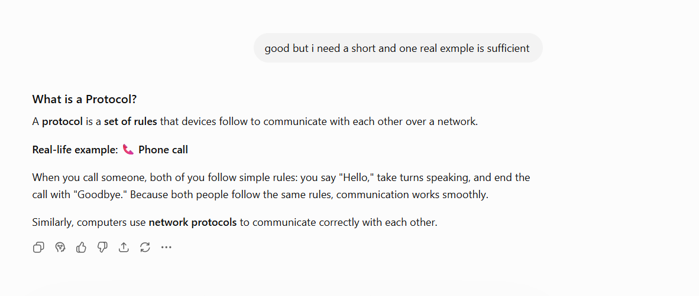
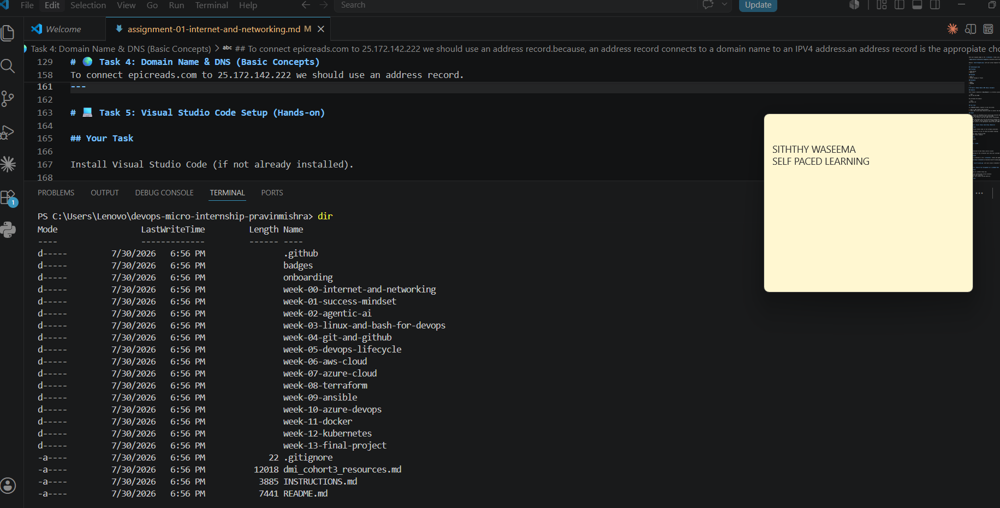

# Week 00 - Internet and Networking

Part of the DevOps Micro Internship (DMI) Cohort 3 with Agentic AI

---

# 🧑‍💻 Task 1: Using ChatGPT as Your Learning Assistant

## Scenario

You're new to DevOps and will frequently encounter technical questions. ChatGPT can be your learning companion.

## Your Task

Write a clear ChatGPT prompt to help you understand:

> "What is a protocol in networking? Explain with a simple real-life example."

Take a screenshot of your interaction showing:

* Your detailed prompt (with clear expectations)
* ChatGPT's simplified response with an example

## Screenshot

Save your screenshot in the `screenshots` folder and update the file name below.




Replace `task-1-chatgpt.png` with your actual screenshot file name.

---

## What I Learned (2–3 lines)

I learned chatgpt responces only based on how we prompt, so if we couldnt prompt the way we want its never answer correctly.
here i learned what is a protocol in simple way with a real life explanation.
initially, i got a long responces since i mentioned beginer friendly, so chatgpt respond with all the possible scenarios, but then i ask for the short explanation and one scenario i got a answer with simple explanation.

---

# 🌐 Task 2: Internet and Networking

## Scenario

Your friend is launching an online bookstore named **EpicReads**.

He asked you to explain how users globally can access his website hosted in Finland.

## Your Task

Write a short explanation (**100–150 words**) that includes:

* Packet Switching
* IP Address
* TCP/IP
* HTTP/HTTPS

💡 **Tip:** You may use ChatGPT (as demonstrated in Task 1) to refine your explanation.

## Answer

When a user in the USA visits the EpicReads website hosted in finland, user enter the website address in their browser.The browser uses the website's IP address to find he correct server in Finland.

The request is sent over the internet using the TCP/IP protocol, which ensures the data is delivered correctly and in the right order.The data is divided into small pieced called packets through packet switching.

These packets may travel along different routes but are reassembled when they reach the user's device.

The browser commmunicated with the server using HTTP or HTTPS.

with HTTPS providing a secure, encrypted connection.Finally, the server sends the webpage back to the user, allowing them to view the EpicReads website.
---

# 🏗️ Task 3: Application Architecture & Stack

## Scenario

EpicReads bookstore has two application versions:

### Two-Tier Application

* Frontend
* Database

### Three-Tier Application

* Frontend
* Backend
* Database

## Your Task

* Draw simple diagrams (hand-drawn or tool-based such as draw.io)
* Label each layer clearly
* List at least two common technologies or tools used for each layer
* Submit a screenshot or photo clearly showing your own drawing

## Diagram Screenshot / Photo

Save your diagram image in the `screenshots` folder and update the file name below.


---

## Technologies Used

### Frontend

* HTML/CSS/JS
* React.js

### Backend

* Node.js
* Python (Django or Flask)

### Database

* MySql
* MongoDB

---

# 🌍 Task 4: Domain Name & DNS (Basic Concepts)

## Scenario

Your friend's bookstore **EpicReads** is currently accessible through:

```text
52.172.142.222:3000
```

He purchased the domain:

```text
epicreads.com
```

## Your Task

In **50–100 words**, explain in your own words:

1. What is DNS (Domain Name System)?
2. Which DNS record type should be used to connect the domain to the given IP, and why?

## Answer

DNS is similar to phonebook which record and translate address to numeric value.
example: epicreads.com to 52.172.142.222.3000
so browser can easily find the right server accordingly.

To connect epicreads.com to 25.172.142.222 we should use an address record.
because, an address record connects to a domain name to an IPV4 address.
an address record is the appropiate choice.The port 3000 is configured on the server and is not part of the DNS record.
---

# 💻 Task 5: Visual Studio Code Setup (Hands-on)

## Your Task

Install Visual Studio Code (if not already installed).

Take a screenshot of your VS Code environment showing:

* Terminal open inside VS Code
* Running a basic command:

### Windows

```powershell
dir
```

### Linux / macOS

```bash
pwd
ls
```

* Your selected VS Code theme clearly visible

⚠️ **Important:** The screenshot must show your username or another identifiable detail to confirm it is your environment.

## Screenshot

Save your screenshot in the `screenshots` folder and update the file name below.




Replace `task-5-vscode.png` with your actual screenshot file name.

---

# 🔗 Task 6: Publish Your Assignment as a LinkedIn Post

## Objective

Publishing on LinkedIn helps you:

* Build your professional online presence
* Reinforce your learning
* Document your DevOps journey publicly

## Your Task

Summarize your answers from Tasks 1–5 into a LinkedIn post.

Clearly structure your post into the following sections:

* ChatGPT
* Internet & Networking
* App Architecture
* DNS
* VS Code Setup

Add the following credit note at the end of your post:

> **P.S. This post is part of the DevOps Micro Internship (DMI) with Agentic AI — Cohort 3 — by Pravin Mishra. My graded progress is public: https://dmi.pravinmishra.com/s/YOUR-GITHUB-USERNAME.html · Start your DevOps journey: https://dmi.pravinmishra.com/?utm_source=student&utm_medium=ps-linkedin&utm_campaign=cohort3**

---

## LinkedIn Post URL

Paste your LinkedIn post URL here:

https://www.linkedin.com/posts/siththi-waseema-62a0b0187_devops-learninginpublic-networking-ugcPost-7488966886051692544-azgc/?utm_source=share&utm_medium=member_desktop&rcm=ACoAACv5boIBHr4DjAudB4kGRvqYrehYIp1o_Io


---

## LinkedIn Post Backup Copy

Paste the full text of your LinkedIn post here:

Back to the fundamentals – Self-Paced DevOps Learning
Week -00
After completing the DevOps Micro Internship (DMI) Cohort, I was excited to get another opportunity to continue learning through the self-paced DevOps program. Going back to the basics has reminded me that a strong foundation is just as important as learning advanced tools.

Here are a few concepts I learned and revised this week:

🌐 What is a Network Protocol?
A protocol is a set of rules that allows devices to communicate with each other over a network.

📞 Simple example: Just like people follow basic rules during a phone call, computers also follow protocols so they can exchange information correctly.

🌍 How does a website hosted in another country work?

If a website is hosted in Finland, someone in the USA can still access it because:

DNS converts the website name into an IP address.
TCP/IP delivers the data between the user and the server.
Packet Switching splits the data into small packets that travel across the internet and are reassembled at the destination.
HTTP/HTTPS is used to request and securely receive the website.

🏗️ Application Architecture
I also revised the difference between the following:
Two-Tier Architecture → Frontend ↔ Database
Three-Tier Architecture → Frontend ↔ Backend ↔ Database
Adding a backend layer makes applications more secure, scalable, and easier to maintain.

🌍 DNS Basics
DNS (Domain Name System) works like the internet's phonebook by converting domain names into IP addresses.
To connect a domain such as epicreads.com to an IPv4 address, we use an A Record, which maps the domain name to the server's IP address.
Sometimes revisiting the basics is the best way to build confidence before moving on to more advanced DevOps topics. Looking forward to the next lessons and continuing to learn step by step. 

P.S. This post is part of the DevOps Micro Internship (DMI) with Agentic AI — Cohort 3 — by Pravin Mishra. 

My graded progress is public: https://lnkd.in/gshacqei · Start your DevOps journey: https://lnkd.in/gT_4qV-r

---

# Reflection – Week 0

### What did you find easy?

since i did this in chort 2, also using chatgpt actually again easily i understand the concept.

---

### What was difficult?

i find difficult in dns type, which i learned today..i was not aware aboyt the types and address record etc..

---

### What will you improve next week?

While watching the video will more consider the basic concepts as well.

---

## 📌 About DMI & CloudAdvisory

DevOps Micro Internship (DMI) is a project-based DevOps program run by Pravin Mishra (The CloudAdvisory) focused on real-world execution, systems thinking, and career readiness.

It helps learners build strong DevOps foundations with hands-on experience.


## 📌 Resources

- 🌐 **DMI Official Website:** https://dmi.pravinmishra.com?utm_source=github&utm_medium=readme  
- 🎓 **University:** https://university.pravinmishra.com?utm_source=github&utm_medium=readme  
- 💬 **Discord Community:** https://discord.pravinmishra.com?utm_source=github&utm_medium=readme  
- 📝 **Blog:** https://dmi.pravinmishra.com/blog?utm_source=github&utm_medium=readme  
- ▶️ **YouTube Playlist (DMI Cohort 3):** https://www.youtube.com/playlist?list=PLFeSNDtI4Cho  
- 🔗 **Pravin Mishra (LinkedIn):** https://www.linkedin.com/in/pravin-mishra-aws-trainer/  
- 🏢 **CloudAdvisory (LinkedIn):** https://www.linkedin.com/company/thecloudadvisory/

---

*This submission is part of DevOps Micro Internship (DMI) Cohort 3 — Agentic AI Track*